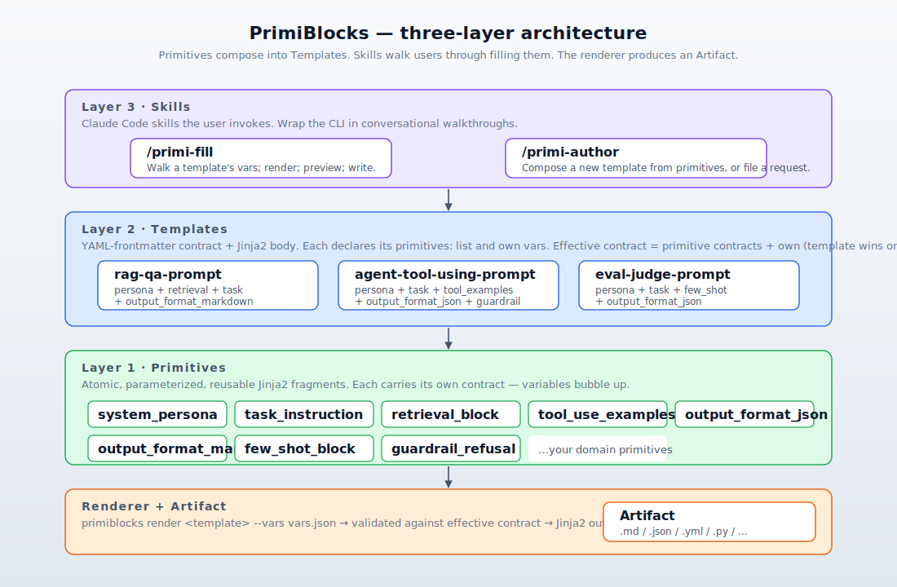
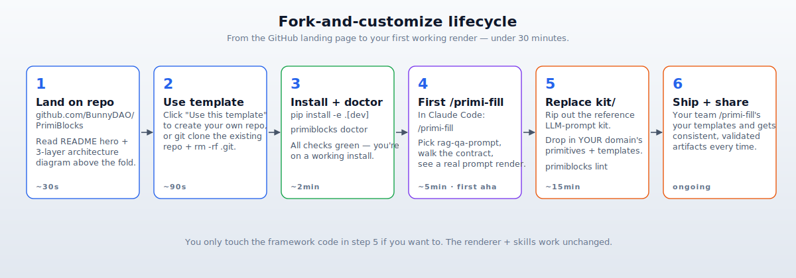

# PrimiBlocks

> **Compose typed, contract-validated artifacts from a Lego kit of primitives.** Fork this template, replace `kit/`, and ship a domain-specific generator with two pre-wired Claude Code skills.

[](https://github.com/BunnyDAO/PrimiBlocks/actions/workflows/test.yml)




PrimiBlocks is a **clonable, cross-OS scaffold + methodology** for building domain-specific generators using a proven pattern: **primitives** (atomic Jinja2 fragments with typed contracts) compose into **templates** (the shapes you want to fill), and two Claude Code **skills** (`/primi-fill`, `/primi-author`) walk users through filling or authoring them. The renderer validates the contract and emits a deterministic artifact — no freeform LLM code-gen, no copy-paste drift.

The reference kit (`kit/`) ships an **LLM prompt composition** example with 8 primitives and 3 templates so you can see the pattern in 30 seconds. You replace it with **your** domain — camera testing, infra provisioning, content workflows, code review prompts, anything that benefits from constrained composition.

---

## Quickstart — 30 seconds

```bash
# 1. Use this template on GitHub (or):
git clone https://github.com/BunnyDAO/PrimiBlocks.git my-kit && cd my-kit && rm -rf .git && git init

# 2. Install
python -m pip install -e ".[dev]"

# 3. Sanity-check
primiblocks doctor

# 4. Render the reference RAG-QA prompt
primiblocks render rag-qa-prompt --vars kit/vars.example.json
```

Or in Claude Code: type `/primi-fill`, pick a template, walk the questions, watch the prompt assemble itself.

---

## Same framework. Any artifact format.

The reference kit happens to ship LLM prompts, but **PrimiBlocks doesn't care what you render to.** The renderer emits *text*. Whatever your downstream toolchain consumes — markdown, YAML, JSON, XML, Python, shell, Terraform, SQL — is a valid artifact.


Three radically different domains, **identical** PrimiBlocks scaffolding. The framework (renderer + skills) is byte-identical in all three. The only thing that differs is what's inside `kit/`.

### Worked example — camera testing

If your team already does camera/vision testing with a sequencer + a `.seqx` file format, the natural artifact is a `.seqx`:

| Layer            | What goes here                                                                                    |
|------------------|---------------------------------------------------------------------------------------------------|
| `kit/primitives/`| `camera_setup.j2`, `load_fgr_pattern.j2`, `tile_rois.j2`, `assert_roi_uniformity.j2`              |
| `kit/templates/` | `fgr_uniformity_check.j2` composes those + a `<sequence>` wrapper                                  |
| Rendered artifact| `fgr_uniformity.seqx` — a fully validated sequence file                                            |
| Downstream       | `camera-cli run fgr_uniformity.seqx` → your sequencer executes it                                  |

A vision engineer runs `/primi-fill`, picks `fgr_uniformity_check`, the skill walks them through *every variable the template + primitives declare* (camera ID, exposure, ROI bounds, Lv tolerance, allowed variance % — grouped by primitive so the mental scaffolding maps to the test structure), validates each answer against the contract, and writes a `.seqx` they can run immediately. They never hand-edit XML.

If your team's test runner is pytest instead of the sequencer (the [HITL](https://github.com/BunnyDAO/HITL) pattern), swap the primitive bodies to emit Python and render to `.py` instead. Same framework, different artifact extension.

### Why this matters

Today, every camera test gets hand-written. Variable values drift across runs. Two engineers write subtly different sequences for the "same" test. There's no contract enforcement — a typo in an ROI bound surfaces as a confusing assertion failure ten minutes into execution.

PrimiBlocks puts the **shape** of the test under version control (the template), the **building blocks** under version control (the primitives), and lets the renderer enforce the **typed contract** before a single frame is captured. A non-developer authors hundreds of validated, reproducible tests via conversation. The vars JSON from every `/primi-fill` run is persisted, so any test is rerunnable byte-for-byte.

The same logic applies for **any** domain where you currently hand-author the inputs to an existing toolchain — infra configs, CI workflows, content briefs, agent prompts, code-review checklists. PrimiBlocks replaces *manual, error-prone authoring*, not the toolchain.

---

## Fork-and-customize lifecycle



You touch the framework code (`primiblocks/`) only if you want to. The renderer, both skills, the linter, and CI all work unchanged against any kit you drop in.

---

## What ships in v1

- **Renderer** — a cross-OS Python module (Jinja2 + PyYAML, nothing else) that validates a rich typed contract (`string|int|float|bool|list|path|enum` + `enum`, `min`/`max`, `pattern`, `examples`, descriptions) before rendering.
- **Primitive-contract bubbling** — primitives declare their own variables; templates list `primitives: [...]` in frontmatter; the renderer aggregates an **effective contract**, with template-level overrides winning on collision ([ADR-0002](docs/adr/0002-primitives-carry-contracts-that-bubble-up.md)).
- **`primiblocks` CLI** — `render | validate | contract | lint | list | new | doctor` subcommands, all with `--json` for programmatic consumption.
- **Two Claude Code skills** — `/primi-fill` (conversational walkthrough, grouped by primitive, validates per-answer, previews before write) and `/primi-author` (compose new templates from existing primitives, or file a structured request when primitives are missing).
- **Reference kit** — 8 LLM-prompt primitives (`system_persona`, `task_instruction`, `retrieval_block`, `tool_use_examples`, `output_format_json`, `output_format_markdown`, `few_shot_block`, `guardrail_refusal`) and 3 templates (`rag-qa-prompt`, `agent-tool-using-prompt`, `eval-judge-prompt`).
- **Cross-OS CI** — macOS, Linux, Windows × Python 3.11 / 3.12 / 3.13. Pure-Python deps. No brew, no Rust.
- **A real SOP** — see [SOP.md](SOP.md) for the developer + non-developer paths.

---

## Why this exists

Two existing projects ([HITL](https://github.com/BunnyDAO/HITL) for camera testing, [Agent-Builder](https://github.com/BunnyDAO/Agent-Builder) for Claude Code agent crews) independently proved the same pattern: **constrain LLM-driven artifact generation by composing reviewed primitives into typed templates and walking the user through the contract via a skill.** The result is deterministic, auditable artifacts — not freeform code-gen.

PrimiBlocks extracts that pattern into a clonable scaffold so every new domain doesn't have to reverse-engineer the convention from a working example, and so the renderer dependency works on **any OS** (the original pattern used a brew-only Rust CLI). See [ADR-0001](docs/adr/0001-bundled-python-renderer-not-sc-compose.md) for the renderer trade-off.

---

## Vocabulary

See [CONTEXT.md](CONTEXT.md) — the project's canonical glossary. The most load-bearing terms:

- **Primitive** — atomic Jinja2 fragment with its own contract
- **Template** — composition of primitives + own contract + Jinja2 body
- **Effective contract** — the union of a template's contract and every composed primitive's contract (template wins on collision)
- **Scaffold** — this repo, in its forkable form
- **Domain kit** — what you build inside `kit/` after forking

---

## How this was built

PrimiBlocks v1 was built using [**Valkyrie**](https://github.com/BunnyDAO/Valkyrie) — a workflow orchestrator that refuses to let you skip straight to implementation. Every coding task is forced through **DESIGN → PRD → ISSUES → TDD** before a single line of production code lands. A pre-commit hook actually blocks edits to production files while the stage is `design`, `prd`, or `issues` — the friction is the product.

Concretely, here's what that produced for v1:

- A grilling session that locked the architecture before any code (intent + domain + 9 sharpening questions)
- A PRD at [`docs/prd/primiblocks-v1.md`](docs/prd/primiblocks-v1.md) that the human substantively approved decision-by-decision before issues were generated
- 17 vertical-slice issues in [`issues/`](issues/), each independently grabbable with a `blocked_by` dependency map
- Each issue implemented red-green-refactor — write the failing test, write the minimal code to pass, refactor, commit; one commit per slice; 97 tests at the end

The two foundational ADRs ([0001](docs/adr/0001-bundled-python-renderer-not-sc-compose.md), [0002](docs/adr/0002-primitives-carry-contracts-that-bubble-up.md)) and the [glossary](CONTEXT.md) are durable artifacts of that flow — they were written *during* DESIGN, not bolted on after.

## Further reading

- **[SOP.md](SOP.md)** — full operating procedure: non-developer path, developer path, contract grammar reference, CLI reference, skill UX, troubleshooting
- **[docs/prd/primiblocks-v1.md](docs/prd/primiblocks-v1.md)** — the PRD that drove v1
- **[docs/adr/](docs/adr/)** — architecture decisions with the trade-offs spelled out
- **[issues/](issues/)** — the 17 vertical-slice issues v1 was built from (TDD'd one at a time)

---

## License

MIT. See [LICENSE](LICENSE).
