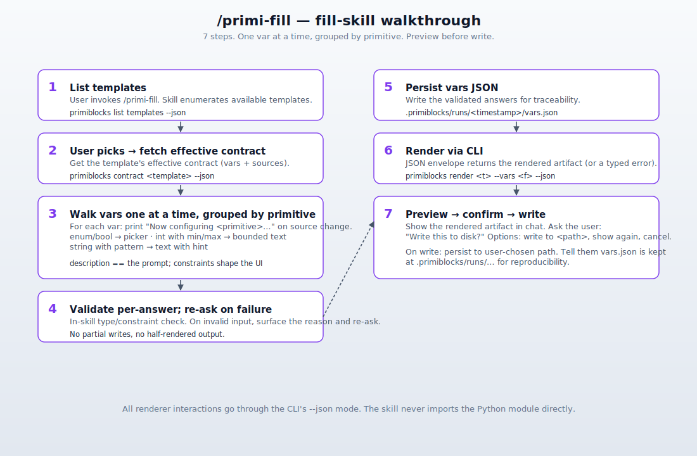
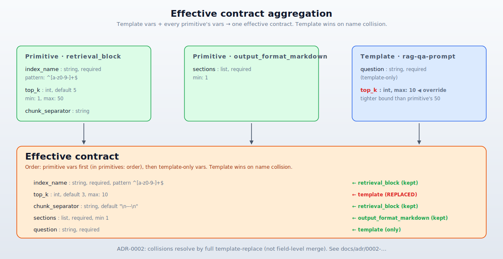
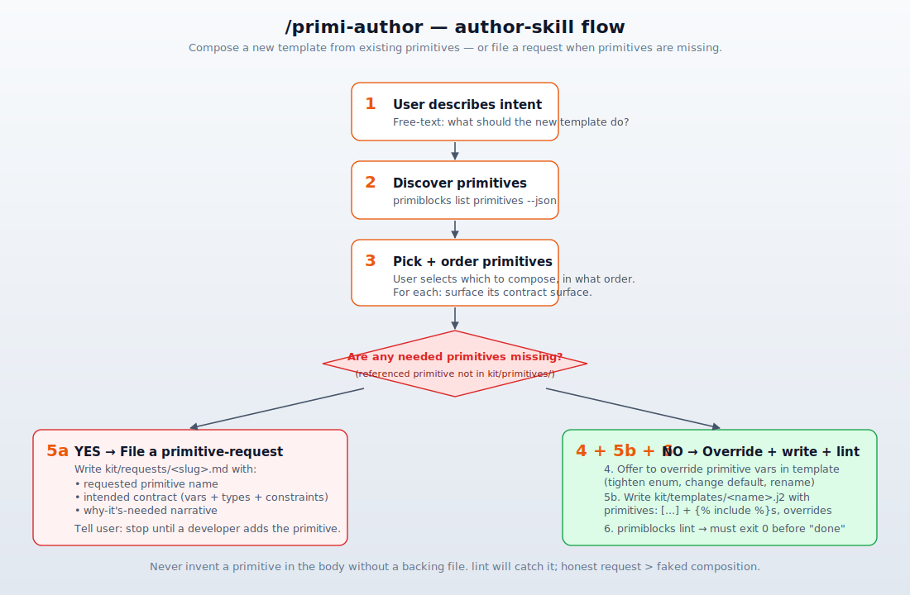
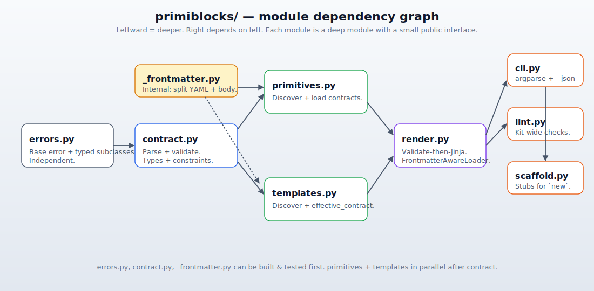

# PrimiBlocks — Standard Operating Procedure

> This document is the operating manual for PrimiBlocks. It splits into two reader paths: one for **non-developers using a kit someone else built**, and one for **developers building a new domain kit**.

## Table of contents

- [Who you are, where to start](#who-you-are-where-to-start)
- **Non-developer path** — Using a kit
  - [Install + sanity check](#install--sanity-check)
  - [Pick a template](#pick-a-template)
  - [Run /primi-fill](#run-primi-fill)
  - [Re-render with tweaked vars](#re-render-with-tweaked-vars)
  - [When something goes wrong](#when-something-goes-wrong)
- **Developer path** — Building a kit
  - [The mental model](#the-mental-model)
  - [Contract grammar reference](#contract-grammar-reference)
  - [Authoring a primitive](#authoring-a-primitive)
  - [Authoring a template](#authoring-a-template)
  - [Using /primi-author](#using-primi-author)
  - [The renderer's module map](#the-renderers-module-map)
  - [CLI subcommand reference](#cli-subcommand-reference)
  - [The linter](#the-linter)
  - [Troubleshooting with `doctor`](#troubleshooting-with-doctor)

---

## Who you are, where to start

| You are…                                                                                    | Start here                                          |
|---------------------------------------------------------------------------------------------|-----------------------------------------------------|
| Filling in a template someone else built (and want a working artifact in minutes)            | [Non-developer path](#install--sanity-check)        |
| Building a new domain kit from scratch (camera testing, infra, prompts, content, …)         | [Developer path](#the-mental-model)                  |
| Triaging "why isn't this working?"                                                          | [When something goes wrong](#when-something-goes-wrong) and [`doctor`](#troubleshooting-with-doctor) |

> **Both paths assume Claude Code is installed.** The two skills (`/primi-fill`, `/primi-author`) are Claude Code skills shipped at `.claude/skills/`. You can also drive the CLI directly without Claude Code if you prefer.

---

# Non-developer path — Using a kit

You've forked PrimiBlocks (or someone else's PrimiBlocks-based repo). Goal: render an artifact (a prompt, a config, a test) without writing the vars JSON by hand.

## Install + sanity check

From the repo root:

```bash
python -m pip install -e ".[dev]"
primiblocks doctor
```

`doctor` reports a per-check rundown. If anything's not green, fix it before continuing — common issues:

- **`python_version`** not green → install Python 3.11 or newer.
- **`dep_jinja2` / `dep_yaml`** not green → re-run `pip install -e ".[dev]"`.
- **`kit_dir_exists`** not green → you're not in the repo root, or `kit/` was deleted.

## Pick a template

```bash
primiblocks list templates
```

You'll get a list like:

```
  rag-qa-prompt            (composes: system_persona, retrieval_block, task_instruction, output_format_markdown)
  agent-tool-using-prompt  (composes: system_persona, task_instruction, tool_use_examples, output_format_json, guardrail_refusal)
  eval-judge-prompt        (composes: system_persona, task_instruction, few_shot_block, output_format_json)
```

Pick the one closest to what you want to do.

## Run /primi-fill

In Claude Code:

```
/primi-fill
```

The skill will:



1. List the templates → ask which one.
2. Fetch that template's **effective contract** (the union of its own variables and every variable contributed by each primitive it composes).
3. Walk you through the variables **one at a time, grouped by primitive**, using each variable's `description` as the question and its constraints to shape the picker.
4. Validate each answer; re-ask on failure with the renderer's error message.
5. Persist your answers to `.primiblocks/runs/<timestamp>/vars.json`.
6. Render the artifact via `primiblocks render`.
7. Show you a preview. You confirm; it writes to a path you specify.

If you cancel at step 7, the vars JSON is still on disk — you can rerun `primiblocks render <template> --vars .primiblocks/runs/<timestamp>/vars.json` later.

## Re-render with tweaked vars

The vars JSON from your last `/primi-fill` is reusable. Edit it directly, then:

```bash
primiblocks render <template> --vars .primiblocks/runs/<timestamp>/vars.json --out my-output.txt
```

Faster than re-walking the skill if you're iterating on one or two answers.

## When something goes wrong

| Symptom                                       | First thing to check                                                                              |
|-----------------------------------------------|---------------------------------------------------------------------------------------------------|
| `primiblocks: command not found`              | `pip install -e ".[dev]"` from the repo root                                                       |
| "missing required variable: 'X'"              | You omitted a required answer in `/primi-fill`. Re-run and answer it.                              |
| "variable 'X' value Y not in enum [...]"      | The value you gave isn't an allowed choice. Pick from the listed options.                          |
| "variable 'X' value Y below min / above max"  | Your numeric answer is out of the declared range. Adjust.                                          |
| "variable 'X' value Y does not match pattern" | Your answer doesn't match the regex. Inspect the pattern in the template's frontmatter.            |
| Rendered output looks empty / garbled         | Run `primiblocks lint --kit-dir kit` — the kit may have a broken primitive include.                |
| Skills don't show up in Claude Code           | Restart Claude Code; verify `.claude/skills/primi-fill/` and `.claude/skills/primi-author/` exist. |

If `primiblocks doctor` is red anywhere, fix that first — it's a faster path to the real cause than tearing into the rendered output.

---

# Developer path — Building a kit

You've forked PrimiBlocks. Goal: replace the reference LLM-prompt kit in `kit/` with **your** domain — and ship.

## The mental model

PrimiBlocks is **three layers** (see [3-layer architecture](docs/diagrams/3-layer-architecture.svg) in the README):

- **Primitives** — atomic, parameterized Jinja2 fragments under `kit/primitives/*.j2`. Each declares the variables it consumes in YAML frontmatter.
- **Templates** — compositions under `kit/templates/*.j2`. Each declares `primitives: [...]` plus its own variables in frontmatter. The body is Jinja2 that ``s the listed primitives.
- **Skills** — `/primi-fill` and `/primi-author` (Claude Code), wrapping the bundled CLI.

The renderer computes the **effective contract** before validating supplied vars:



When a template lists `primitives: [foo, bar]`, the renderer takes the union of the template's own vars and each primitive's vars. On name collision, the **template's** declaration replaces the primitive's entirely — letting template authors tighten constraints, change defaults, or rename without forking the primitive. This is [ADR-0002](docs/adr/0002-primitives-carry-contracts-that-bubble-up.md).

## Contract grammar reference

Every primitive and template carries YAML frontmatter fenced by `---`. Schema:

```yaml
---
description: One-line summary of what this primitive/template emits.   # required
primitives:                                                            # templates only; optional
  - retrieval_block
  - output_format_json
vars:                                                                  # optional
  - name: index_name             # required
    type: string                 # required: string|int|float|bool|list|path|enum
    description: …               # required (drives the fill-skill's question)
    required: true               # default true
    default: null                # used when required: false and var omitted
    examples: ["prod-docs"]      # informational only
    enum: ["prod-docs", "staging-docs"]   # optional constraint
    min: 1                       # optional; int/float value; list length
    max: 50                      # optional; int/float value; list length
    pattern: "^[a-z0-9-]+$"      # optional; regex for string-shaped types
    hidden: false                # 0.2.0+; UX hint — see "The `hidden` flag" below
---
```

Notes:

- **`description` is mandatory** on every variable. The fill-skill uses it as the question.
- **`pattern` applies** to `string`, `enum`, and `path` types. It does *not* apply to int/float (use `min`/`max` instead).
- **`min`/`max` on lists** check the list's length (not element values).
- **`int` explicitly rejects `bool`** at validation (Python's `isinstance(True, int)` is True; we guard against that silent bug).
- **`path` is string-shaped** — we don't check filesystem existence at render time.
- **Defaults bypass type-checking** today (an author who sets `default: "foo"` on a `type: list` won't be told). This is a known sharp edge; the linter may catch it in a later version.

### The `hidden` flag (v0.2.0+)

Mark a var `hidden: true` when the var exists in the contract (for validation, defaults, primitive bubbling) but you don't want `/primi-fill` to ask the user about it. Typical use: template-level overrides of primitive vars that the template body sets per-include via Jinja `` blocks. Without `hidden: true`, those plumbing vars would each become an extra question in the walkthrough.

```yaml
- name: tristimulus
  type: enum
  description: (internal — set per-include via )
  enum: [TrisX, TrisY, TrisZ]
  hidden: true
  default: TrisY
  required: false
```

**Critical caveat — `hidden` is a UX hint, NOT a security boundary.** A hidden var is still in the contract. If someone supplies it directly via `primiblocks render --vars vars.json` (bypassing `/primi-fill`), the renderer accepts that value and uses it. Hiding only removes the var from the *conversational walkthrough* — it does **not** lock or seal it.

If you actually want a value to be unoverridable (a literal constant that no caller — skill, CLI, or future maintainer — can change), **don't declare it as a contract var at all.** Bake it into the primitive's body as a plain string. Contract vars are knobs by definition; hiding a knob from the UI doesn't make it not-a-knob.

## Authoring a primitive

A primitive is one `.j2` file under `kit/primitives/`. Minimal example:

```jinja2
---
description: Inserts a retrieval-grounded context block.
vars:
  - name: index_name
    type: string
    description: Name of the index to query.
    pattern: "^[a-z0-9-]+$"
  - name: top_k
    type: int
    description: How many chunks to retrieve.
    min: 1
    max: 50
    default: 5
    required: false
---
## Retrieved context (index={{ index_name }}, top_k={{ top_k }})

<<RETRIEVED_CHUNKS>>
```

The body is plain Jinja2. Variables you reference (`{{ index_name }}`, `{{ top_k }}`) must appear in your contract.

Scaffold a stub with:

```bash
primiblocks new primitive my_primitive
```

## Authoring a template

A template is one `.j2` file under `kit/templates/`. It composes primitives via `primitives:` frontmatter + `` in the body:

```jinja2
---
description: A retrieval-augmented QA prompt with a structured markdown answer.
primitives:
  - system_persona
  - retrieval_block
  - task_instruction
  - output_format_markdown
vars:
  - name: question
    type: string
    description: The user's question.
---





## User question

{{ question }}
```

The `primitives:` frontmatter and the `` statements **must agree** — the linter catches drift in either direction. Scaffold a stub with:

```bash
primiblocks new template my_template
```

### Overriding a primitive's var

If a template needs a tighter constraint than the primitive provides, declare a `vars:` entry in the template's frontmatter with the same `name`:

```yaml
primitives: [retrieval_block]
vars:
  - name: top_k
    type: int
    description: Tighter bound for this template.
    min: 1
    max: 10        # primitive allowed up to 50; template tightens to 10
    default: 3
```

The template's declaration **replaces** the primitive's entirely (no field-level merge). This is the *only* mechanism for diverging from a primitive's contract — never inline-edit the primitive itself for a one-off template.

## Using /primi-author

When the new template is non-trivial, drive the authoring via the skill:



1. Tell the skill what you want.
2. It lists available primitives.
3. You pick and order them.
4. You override any vars you want.
5a. If a needed primitive doesn't exist → it writes `kit/requests/<slug>.md`. Stop until a developer fulfills the request.
5b. If everything exists → it writes `kit/templates/<name>.j2`.
6. It runs `primiblocks lint` against the new template and stops only when clean.

## The renderer's module map

For contributors changing renderer internals:



- `errors.py` — typed errors. Independent.
- `_frontmatter.py` — split YAML frontmatter from Jinja2 body. Internal.
- `contract.py` — `Contract.parse` + `Contract.validate`. Type + constraint enforcement.
- `primitives.py` — discover `kit/primitives/*.j2`, parse contracts.
- `templates.py` — discover `kit/templates/*.j2`, compute effective contract.
- `render.py` — orchestrate validate → Jinja2 render. `FrontmatterAwareLoader` strips frontmatter from ``'d files.
- `cli.py` — argparse + `--json` envelope.
- `lint.py` — kit-wide drift and orphan checks.
- `scaffold.py` — `new template` / `new primitive` stubs.

## CLI subcommand reference

Every subcommand supports `--json` (returns `{"ok": bool, "data"?: …, "error"?: {kind, message}}`) and `--kit-dir <path>` (default: `./kit`).

| Command                                          | What it does                                                                          |
|--------------------------------------------------|----------------------------------------------------------------------------------------|
| `primiblocks render <T> --vars FILE [--out FILE]`| Render template `T` against vars in FILE; write to stdout or `--out`.                  |
| `primiblocks validate <T> --vars FILE`            | Validate vars against `T`'s effective contract without rendering.                       |
| `primiblocks contract <T>`                        | Dump `T`'s effective contract (used by skills to drive walkthroughs).                   |
| `primiblocks lint`                                | Kit-wide checks: drift, broken includes, missing descriptions, orphan primitives.     |
| `primiblocks list templates \| primitives`        | Enumerate the kit's contents with each item's vars / primitives.                        |
| `primiblocks new template \| primitive <name>`    | Scaffold a lint-clean stub at the right path.                                          |
| `primiblocks doctor`                              | Diagnose Python version, deps, kit layout, lint clean.                                 |

Exit codes:

- **0** — success
- **1** — contract / render / validation / lint error
- **2** — usage error (argparse)

## The linter

`primiblocks lint` emits two severities:

- **error** — something the renderer would refuse at run time
  - `frontmatter-include-drift` — a primitive is in `primitives:` but not ``'d, or vice versa
  - `broken-include` — referenced primitive not on disk
- **warning** — something the renderer tolerates but worth knowing
  - `orphan-primitive` — primitive exists but no template composes it

The CI smoke test (`tests/test_reference_kit.py`) asserts the reference kit lints clean on every PR.

## Troubleshooting with `doctor`

When something is off, `primiblocks doctor` is the fastest triage:

```
  ✓  python_version          3.13.13
  ✓  dep_jinja2              importable
  ✓  dep_yaml                importable
  ✓  kit_dir_exists          kit
  ✓  kit_primitives_dir      kit/primitives
  ✓  kit_templates_dir       kit/templates
  ✓  kit_lint_clean          0 errors, 0 warnings

primiblocks: all checks passed.
```

A failed check tells you exactly which assumption is broken. Common fixes:

- **Old Python** → `pyenv install 3.13` (or your tool of choice) and re-create the venv.
- **Missing deps** → `pip install -e ".[dev]"` from the repo root.
- **Missing kit/** → you're outside a forked repo, or `kit/` was deleted.
- **Lint not clean** → run `primiblocks lint` for the specific issues.

---

## Further reading

- [README.md](README.md) — Quickstart and the elevator pitch.
- [CONTEXT.md](CONTEXT.md) — The project glossary (terms have one canonical meaning).
- [docs/prd/primiblocks-v1.md](docs/prd/primiblocks-v1.md) — The PRD that shaped v1.
- [docs/adr/](docs/adr/) — Architecture decisions with trade-offs spelled out.
- [issues/](issues/) — The 17 vertical-slice issues v1 was TDD'd from.
